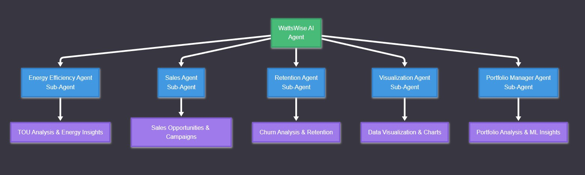
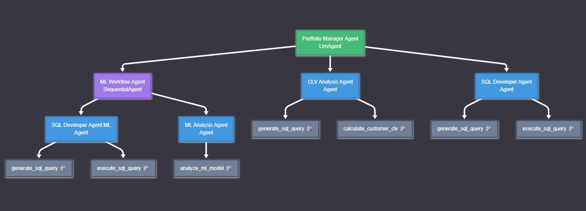
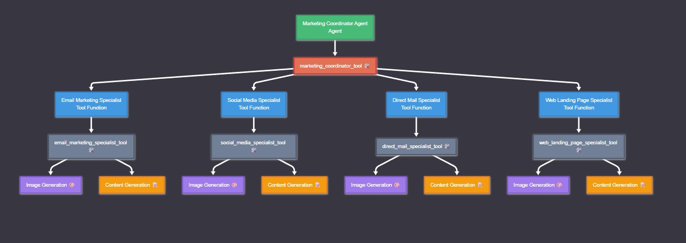
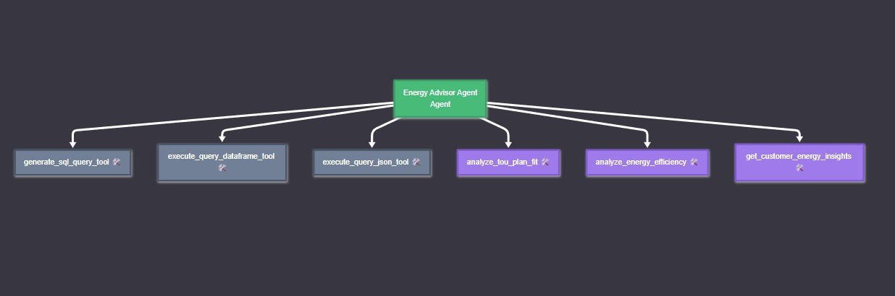
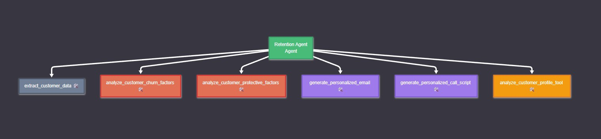
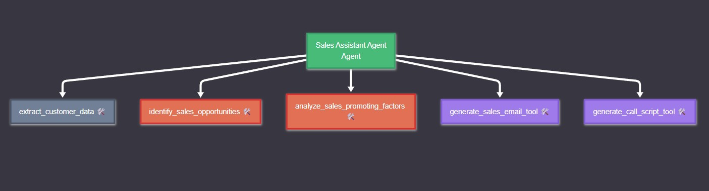
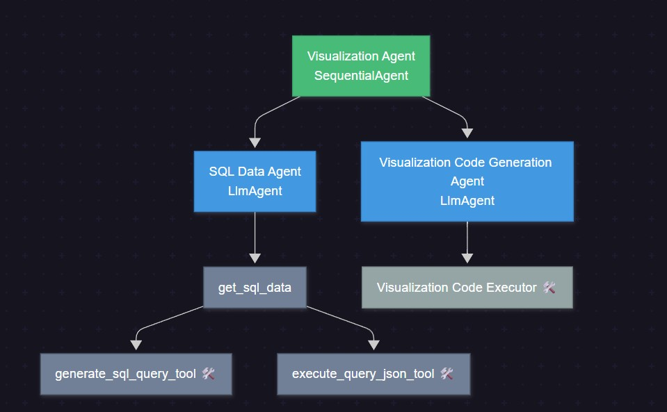
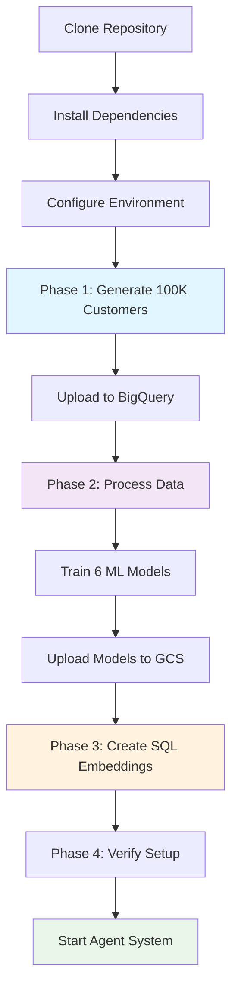

# EnergyAgentAI ⚡🤖

**Intelligent Multi-Agent System for Energy Management & Customer Engagement**

EnergyAgentAI is a comprehensive AI-powered multi-agent system designed for energy management and customer engagement within a retail energy provider context. Built with **Google's Agent Development Kit (ADK)**, this project simulates a complete energy ecosystem serving **100K customers** hosted on BigQuery and GCP, from data analysis and customer profiling to targeted marketing and retention strategies.

## 🚀 Key Features

- **🤖 Multi-Agent Architecture**: Modular design with specialized agents working collaboratively using Google ADK
- **📊 Comprehensive Data Analysis**: SQL, BigQuery, and ML models for in-depth customer and market analysis
- **🎯 Personalized Customer Engagement**: Tailored sales campaigns, retention strategies, and energy efficiency recommendations
- **🧠 AI-Driven Marketing**: Complete downloadable marketing packages with AI-generated visuals and copy
- **💬 Interactive Chat Interfaces**: Streamlit-based UI for interacting with individual agents
- **📈 Advanced ML Analytics**: SHAP explanations, churn prediction, cross-sell opportunities, and upsell probabilities
- **⚡ Energy Intelligence**: Smart meter analysis, TOU plan optimization, and efficiency recommendations

## 🏗️ System Architecture
Visual representation of our Google ADK multi-agent system architecture:

### 🚀 WattsWise AI Agent - Main Coordinator
*The main coordinator that routes requests to specialized sub-agents*



### 📈 Portfolio Agent - Complex ML Workflow  
*Complex ML workflow with SQL and SHAP analysis capabilities*



### 🎯 Marketing Agent System - Multi-Specialist Campaign Generation
*Multi-specialist marketing campaign generation system*



### 🔋 Energy Efficiency Agent - Smart Meter Analysis
*Energy analysis specialist with SQL and efficiency tools*



### 🔄 Retention Agent - Churn Prevention Specialist
*Customer retention specialist with churn analysis and content generation*



### 💼 Sales Agent - Opportunity Identification
*Sales opportunity identification and campaign generation agent*



### 📊 Visualization Agent - Sequential Workflow
*Sequential agent for SQL data retrieval and intelligent code generation*




## 🤖 Specialized Agents

### 🛠️ Data Tool (SQL + BigQuery)
- **Purpose**: Natural language to SQL conversion and execution
- **Capabilities**: 
  - Connects to live BigQuery datasets
  - Converts user questions into optimized SQL queries
  - Handles complex joins, aggregations, and analytics queries
  - Returns structured data for analysis

### 🧠 ML Model Tool (6 Pre-trained Models + SHAP)
- **Purpose**: Machine learning predictions with explainable AI
- **Models Available**:
  - `churn`: Customer churn prediction
  - `crosssell_hvac`: HVAC system cross-sell probability
  - `crosssell_insurance`: Insurance product cross-sell probability  
  - `crosssell_solar`: Solar panel cross-sell probability
  - `upsell_green_plan`: Green energy plan upsell probability
  - `upsell_efficiency_analysis`: Energy efficiency analysis upsell
  - `upsell_surge_protection`: Surge protection upsell probability
- **Features**: SHAP explanations for model interpretability and decision support

### 🔋 Energy Efficiency Agent
- **Purpose**: Smart meter data analysis and optimization recommendations
- **Tools**:
  - `analyze_tou_plan_fit()`: Time-of-Use plan savings analysis
  - `analyze_energy_efficiency()`: Usage pattern optimization
  - `get_customer_energy_insights()`: Comprehensive energy profiling
- **Capabilities**: TOU plan evaluation (8PM-8AM free, daytime 2x cost), efficiency recommendations

### 💼 Sales Agent  
- **Purpose**: AI-driven sales opportunity identification and campaign generation
- **Process**:
  1. Uses ML models to predict sales probabilities for 6 Alberta Energy products
  2. Analyzes customer eligibility and purchase likelihood
  3. Leverages SHAP explanations for prediction justification
  4. Creates personalized email campaigns and call scripts
- **Output**: Ready-to-use sales content with data-driven insights

### 🔄 Retention Agent
- **Purpose**: Churn prevention through personalized retention strategies
- **Workflow**:
  1. Extracts customer data using SQL tools
  2. Analyzes churn factors with SHAP explanations
  3. Identifies protective factors that reduce churn risk
  4. Generates highly personalized retention content
- **Output**: Customized retention emails and call scripts based on exact churn risk factors

### 📊 Visualization Agent
- **Purpose**: Converts natural language queries into visual insights
- **Architecture**: Sequential workflow agent
  1. **SQL Agent**: Generates and executes BigQuery queries
  2. **Code Generation Agent**: Creates matplotlib/seaborn visualizations
- **Output**: Interactive charts with download capabilities

### 📁 Portfolio Agent
- **Purpose**: In-depth market and customer segment analysis
- **Advanced Capabilities**:
  - Combines SQL data gathering with ML model analysis
  - Uses SHAP analysis to explain behavioral patterns
  - Identifies segment-specific opportunities and risks
  - Recommends targeted marketing strategies based on root cause analysis
- **Bonus**: Acts as data science assistant for business teams

### 🎯 Marketing Agent System (Separate ADK Multi-Agent System)
- **Architecture**: Independent Google ADK system with specialist routing
- **Agents**:
  - **📧 Email Marketing Specialist**: Subject line optimization, mobile-first design
  - **📱 Social Media Specialist**: Platform-specific content, engagement optimization
  - **📮 Direct Mail Specialist**: High-response physical mail campaigns
  - **🌐 Landing Page Specialist**: Conversion rate optimization, A/B testing
- **Coordinator**: Auto-detects optimal marketing medium and routes to specialists
- **Output**: Complete downloadable marketing packages with AI-generated visuals

## 🛠️ Technology Stack

**Core Framework:**
- **[Google ADK](https://google.github.io/adk-docs/)** - Multi-agent orchestration framework
- **Gemini 2.0 Flash** - Primary LLM for agent reasoning and content generation
- **Agent2Agent (A2A) Protocol** - Inter-agent communication standard

**Data & ML:**
- **Google BigQuery** - Data warehouse (100K+ customer records)
- **Vertex AI** - ML model hosting and inference
- **SHAP** - Explainable AI for model interpretability
- **XGBoost/Scikit-learn** - Pre-trained prediction models

**Development & Deployment:**
- **Streamlit** - Interactive web interface
- **FastAPI** - REST API endpoints for agent communication
- **Google Cloud Platform** - Infrastructure and deployment
- **Python 3.9+** - Primary development language

## 🏗️ Environment Setup (Critical First Step)

**⚠️ IMPORTANT**: Before running any agents, you must first set up the complete Alberta Energy AI simulation environment with 100K customers and their data infrastructure.

### Phase 1: Data Generation & BigQuery Setup

The project begins by creating a realistic energy provider simulation:

```bash
# 1. Generate 100K simulated customers and smart meter data
# This creates the foundational dataset for Alberta Energy AI - Simulated Dataset with ClaudeAI


# 2. Upload datasets to BigQuery
# Created tables: customers, smart_meter_data, billing_history - Uploaded to GCS buckets and connected to BigQuery
```

**What this creates:**
- **100,000 simulated customers** with realistic demographics, location, and energy profiles
- **Smart meter readings** with hourly usage data, seasonal patterns, and anomalies
- **Billing history** with payment patterns, plan types, and satisfaction scores
- **Geographic distribution** across Canada cities (Calgary, Edmonton, Red Deer, etc.)

### Phase 2: ML Processing Pipeline (`ml_process/` folder)

After data generation, process the data and create ML models:

```bash
# Step 1: Process and prepare data for ML models
python ml_process/main_process_data.py
```

**This script:**
- Cleans and preprocesses customer data
- Creates feature engineering for churn prediction
- Generates cross-sell/upsell opportunity features  
- Splits data into training/validation sets
- Prepares data for 6 different ML models

```bash
# Step 2: Train and create ML models + SHAP objects
python ml_process/main_create_model.py
```

**This script creates 6 pre-trained models:**
- `churn.pkl` - Customer churn prediction model
- `crosssell_hvac.pkl` - HVAC system cross-sell probability
- `crosssell_insurance.pkl` - Insurance product cross-sell
- `crosssell_solar.pkl` - Solar panel cross-sell probability  
- `upsell_green_plan.pkl` - Green energy plan upsell
- `upsell_efficiency_analysis.pkl` - Energy efficiency analysis upsell
- `upsell_surge_protection.pkl` - Surge protection upsell

**Plus SHAP objects for explainability:**
- `shap_explainer_[model_name].pkl` - SHAP explainers for each model
- `shap_values_[model_name].pkl` - Pre-computed SHAP values for analysis

**Storage locations:**
- **Processed datasets** → BigQuery tables
- **Trained models** → Google Cloud Storage buckets
- **SHAP objects** → GCS buckets for real-time explanations

### Phase 3: SQL Agent Intelligence Setup (`notebooks/` folder)

Enable the SQL agent to understand your BigQuery schema:

```bash
# Create table and column embeddings for intelligent SQL generation using jupyter notebook
jupyter notebook notebooks/create_table_description.ipynb
```

**What this creates:**
- **Table embeddings** - Vector representations of all BigQuery table schemas
- **Column embeddings** - Semantic understanding of column meanings and relationships
- **Known good SQL patterns** - Example queries for common energy analytics
- **Schema documentation** - Automated documentation of all database structures

**This tables are ingested to bigquery database**

**This enables:**
- Natural language → SQL conversion with high accuracy
- Context-aware query generation that understands energy domain
- Automatic JOIN detection across related tables
- Error prevention through schema validation


```bash
echo "🎉 Alberta Energy AI environment ready!"
echo "Now you can start the agent system with: streamlit run main_agent_app.py"
```

### Required GCS Bucket Structure

Your Google Cloud Storage should be organized as:

```
your-gcs-bucket/
├── models/
│   ├── churn.pkl
│   ├── crosssell_hvac.pkl
│   ├── crosssell_insurance.pkl
│   ├── crosssell_solar.pkl
│   ├── upsell_green_plan.pkl
│   ├── upsell_efficiency_analysis.pkl
│   └── upsell_surge_protection.pkl
├── shap_objects/
│   ├── shap_explainer_churn.pkl
│   ├── shap_explainer_crosssell_hvac.pkl
│   └── ... (all SHAP explainers)
└── embeddings/
    ├── table_embeddings.json
    ├── column_embeddings.json
    └── sql_patterns.json
```

### BigQuery Dataset Structure

Your BigQuery project should contain:

```
your-project.alberta_energy/
├── customer_data              # 100K customer profiles
├── smart_meter_data      # Hourly usage readings
├── billing_history       # Payment and billing data
├── products              # Customer Products signed
├── know_good_sql   
└── table_embeddings
└── column_embeddings  
```

## 📋 Prerequisites

- **Python 3.9+**
- **Google Cloud Account** with the following enabled:
  - BigQuery API (for data warehouse)
  - Cloud Storage API (for model storage)
  - Vertex AI API (for agent deployment)
- **Sufficient BigQuery quota** for 100K+ customer dataset
- **GCS bucket** with read/write permissions for model storage
- **~2-3 hours** for complete environment setup (data generation + ML training)

## 🚀 Quick Start

### 1. Clone the Repository

```bash
git clone https://github.com/hazardscarn/energyagentai.git
cd energyagentai
```

### 2. Set Up Environment

```bash
# Create virtual environment
python -m venv venv

# Activate virtual environment
# Linux/macOS:
source venv/bin/activate
# Windows:
venv\Scripts\activate
```

### 3. Install Dependencies

```bash
pip install -r requirements.txt
```

### 4. Configure Environment Variables

Create a `.env` file in the root directory:

```bash
# Required Google Cloud Configuration
GOOGLE_CLOUD_PROJECT="your-project-id"
GOOGLE_CLOUD_LOCATION="us-central1"
GOOGLE_GENAI_USE_VERTEXAI="True"

# GCS Bucket for models and SHAP objects
GCS_BUCKET_NAME="your-bucket-name"

# BigQuery Dataset
BIGQUERY_DATASET="alberta_energy"

# Optional: For alternative model access
GOOGLE_API_KEY="your-google-ai-studio-key"
OPENAI_API_KEY="your-openai-key"
```

### 5. Set Up Google Cloud Authentication

```bash
# Install and authenticate with Google Cloud CLI
gcloud auth login
gcloud auth application-default login

# Set your project
gcloud config set project YOUR_PROJECT_ID

# Create GCS bucket for models
gsutil mb gs://your-bucket-name
```

### 6. **CRITICAL**: Complete Environment Setup

**⚠️ You MUST complete the environment setup before running agents:**


### 7. Run the Agent System

**Only after environment setup is complete:**

#### Option A: Streamlit Web Interface (Recommended)

```bash
# Run the main multi-agent application
streamlit run main_agent_app.py
```

Access at `http://localhost:8501`

#### Option B: ADK Development Server

```bash
# For individual agent development and testing
adk web

# Run the agent you want by selecting it
```


## 📁 Project Structure

```
energyagentai/
├── main_agent_app.py           # Main Streamlit application with navigation
├── app.py                      # Alternative main application entry point
├── setup_environment.sh        # Complete environment setup script
│
│
├── ml_process/                 # 🧠 Phase 2: ML model creation
│   ├── main_process_data.py    # Data preprocessing and feature engineering
│   ├── main_create_model.py    # Train 6 ML models + SHAP objects
│   ├── xgb_process/            # XGBoost Module
│
├── notebooks/                  # 🔍 Phase 3: SQL agent intelligence
│   ├── create_table_description.py     # Generate table/column embeddings
│
├── main_agent/                 # 🤖 WattsWise AI coordinator
│   ├── agent.py               # Main coordinator agent with ADK setup
│   └── config.py              # Configuration settings
│
├── energy_efficiency/          # ⚡ Energy analysis specialist
│   ├── agent.py               # Energy advisor with TOU & efficiency tools
│   ├── config.py              # Agent configuration
│   └── energy_analysis_tools.py # Smart meter analysis tools
│
├── sales_agent/               # 💼 Sales opportunity specialist
│   ├── agent.py               # Sales campaign generation agent
│   └── sales_content_tools.py         # ML-driven sales analysis tools
│
├── retention_agent/           # 🔄 Customer retention specialist  
│   ├── agent.py               # Churn analysis and retention campaigns
│   ├── config.py              # Retention agent configuration
│   └── retention_content_tools.py # Email/call script generators
├── portfolio_manager/           # Portfolio Analysis  
│   ├── agent.py               # Portfolio Reports and Analysis
│   ├── config.py              
│
├── marketing_agent/           # 🎯 Marketing campaign system
│   ├── agent.py               # Multi-specialist marketing coordinator
│
├── visualization_agent/       # 📊 Data visualization specialist
│   ├── agent.py               # Chart generation with matplotlib/seaborn
│
├── shared_tools/              # 🔧 Shared components across agents
│   ├── simple_sql_agents.py   # BigQuery SQL tools with embeddings
│   ├── mlagent.py             # ML model + SHAP analysis tools
│   └── utils.py               # Common utilities
│
├── data/                      # 📁 Generated datasets (local cache)
├── models/                    # 🧠 Trained ML models (local cache)
├── images/                    # 🖼️ Agent architecture diagrams
├── requirements.txt           # Python dependencies
├── .gitignore                # Git ignore patterns
└── README.md                 # This file
```

## 🔄 Complete Setup Workflow



## 💡 Why This Setup Process?

**EnergyAgentAI isn't just a collection of agents—it's a complete simulated energy provider ecosystem.**

### 🏢 Alberta Energy AI Simulation
The project creates a realistic retail energy provider with:
- **100,000 unique customers** across Alberta cities
- **Realistic energy usage patterns** based on home types, demographics, and seasons  
- **Smart meter data** with hourly readings, anomalies, and behavioral patterns
- **Billing and payment history** with various plan types and satisfaction scores
- **Service interactions** and customer journey data

### 🧠 AI-Powered Business Intelligence
The ML models aren't generic—they're trained specifically on this energy domain:
- **Churn prediction** based on energy industry factors (billing issues, seasonal usage, plan satisfaction)
- **Cross-sell models** for HVAC, solar, and insurance products relevant to energy customers
- **Upsell models** for green plans, efficiency services, and surge protection
- **SHAP explanations** that provide energy-domain insights ("customer churning due to high winter bills")

### 🔍 Domain-Aware SQL Intelligence
The SQL agent understands the energy business through:
- **Schema embeddings** that know relationships between customers, usage, and billing
- **Energy domain vocabulary** (TOU plans, peak/off-peak rates, demand charges)
- **Pre-trained query patterns** for common energy analytics
- **Context-aware joins** across customer, usage, and satisfaction data

### 🎯 The Result
Once setup is complete, you have agents that can:
- Generate **retention emails** explaining exactly why a customer might leave based on their usage patterns
- Create **sales campaigns** targeting customers most likely to need HVAC services based on their energy data
- Provide **energy efficiency advice** using actual smart meter analysis
- Generate **marketing content** informed by real customer segments and behaviors

**This is what makes EnergyAgentAI special—it's not just LLMs with tools, it's a complete AI-powered energy business simulation.**

## 💬 Usage Examples

### WattsWise AI Coordinator (Main Hub)

```python
# Access via Streamlit interface at http://localhost:8501
# Select "⚡ WattsWise Agent" from navigation

# Example queries:
"Analyze energy efficiency for customer CUST000001"
"Create personalized sales campaign for customer CUST00002508" 
"What is the average churn rate by city?"
"Create a detailed report on main causes for churn in Calgary"
"Generate retention email for at-risk customer CUST00001515"
```

### Energy Efficiency Agent

```python
# TOU Plan Analysis
"Analyze TOU plan fit for customer CUST000001"
"How much could customer CUST000042 save with time-of-use pricing?"

# Efficiency Analysis  
"What are the top energy efficiency improvements for CUST000001?"
"Analyze smart meter data patterns for customer CUST000123"

# Comprehensive Insights
"Give me complete energy insights for customer CUST000001"
```

### Sales Agent

```python
# Opportunity Analysis
"Identify cross-sell opportunities for customer CUST00002467"
"What's the HVAC upsell probability for customer CUST000456?"

# Campaign Generation
"Create sales email campaign for customer CUST00002467"
"Generate call script for solar panel cross-sell to CUST000789"
```

### Retention Agent

```python
# Churn Analysis
"Why might customer CUST00008098 leave?"
"Analyze churn factors for customer CUST000234"

# Retention Campaigns
"Create retention email for customer CUST00008098"
"Generate call script for at-risk customer CUST000567"
```

### Marketing Agent System

```python
# Access via Streamlit navigation: "🎯 Marketing Agent"

# Auto-detection
"Create winter heating campaign for Calgary homeowners"
"Generate HVAC cross-sell campaign with government rebates"

# Specific Medium
"Create email campaign for smart thermostat service"
"Design social media content for energy audit promotion"
"Build landing page for heat pump upgrades"
```

### Visualization Agent

```python
# Data Analysis
"What is the average churn rate by city?"
"Show energy usage patterns by customer segment"
"Create visualization of seasonal consumption trends"

# Business Intelligence  
"Plot customer satisfaction vs tenure"
"Visualize cross-sell success rates by product"
```

### Portfolio Agent

```python
# Market Analysis
"Analyze Calgary market segment performance"
"What drives churn in high-value customers?"
"Identify best opportunities in Edmonton market"

# Strategic Insights
"Create detailed report on customer behavior patterns"
"Analyze ROI of retention campaigns by segment"
```